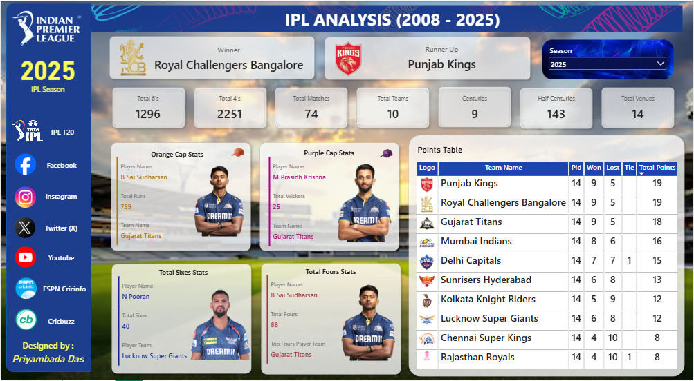

# IPL-Analysis-Dashboard

# 🏆 IPL Analysis Dashboard (2008 - 2025)

An interactive **Power BI dashboard** that visualizes IPL performance and player statistics from **2008 to 2025**.  
It provides deep insights into matches, teams, and players — beautifully designed and data-driven.  

---

## 🖼️ Dashboard Preview

---

## 🌐 Live Dashboard Link
🔗 [View the Live Dashboard on Power BI](https://app.powerbi.com/view?r=eyJrIjoiODM4NWEzZWItOGUzYi00OWRmLTllNGEtZTAxZmQ4Y2YyYmRkIiwidCI6IjFjMWM1MzJjLWRhMDQtNDEwMy05YmZhLWQzNmRmZGIxYjE3ZSJ9)  
*(This is the interactive version published via Power BI Service.)*

---

## 🧠 Project Overview

This dashboard showcases the **complete analysis of the Indian Premier League (IPL)** from its inception in 2008 till 2025.  
It highlights the **winner, runner-up, key players, and major match statistics** for each season.

Key sections include:
- 🏆 Winner & Runner-Up Details  
- 🧢 Orange Cap & Purple Cap Holders  
- 💥 Total Sixes, Fours, Matches, and Centuries  
- 📊 Team-Wise Points Table  
- 📅 Dynamic Season Filter (2008–2025)  

---

## 📊 Key Insights from IPL 2025

| Category | Highlight |
|-----------|------------|
| 🏆 Winner | **Royal Challengers Bangalore** |
| 🥈 Runner-Up | **Punjab Kings** |
| 🧢 Orange Cap | **B Sai Sudharsan (Gujarat Titans)** – 759 Runs |
| 🎯 Purple Cap | **M Prasidh Krishna (Gujarat Titans)** – 25 Wickets |
| 💥 Most Sixes | **N Pooran (Lucknow Super Giants)** – 40 Sixes |
| 🏏 Most Fours | **B Sai Sudharsan (Gujarat Titans)** – 88 Fours |

---

## 🛠️ Tools & Technologies Used
- **Power BI Desktop** – Dashboard Design & DAX Calculations  
- **Power Query** – Data Transformation  
- **Excel / CSV Datasets** – IPL Historical Data  
- **Power BI Service** – Dashboard Hosting (Publish to Web)  
- **Microsoft Fabric & DAX** – For Data Modeling  

---

## 📂 Datasets

All datasets used in this project are combined into a single compressed ZIP file.

➡️ [Download IPL Datasets (ZIP)](IPL_data.zip)

**Included Files:**
- `ball_by_ball_data.csv`
- `ipl_matches_data.csv`
- `players_data_updated.csv`
- `teams_data.csv`

---

